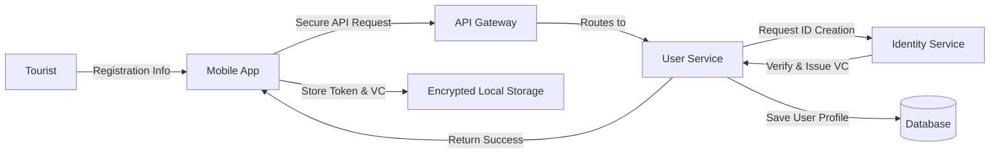
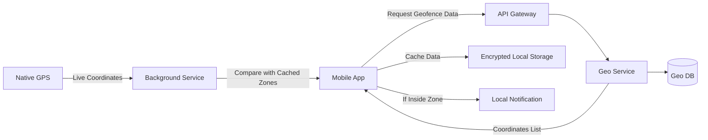
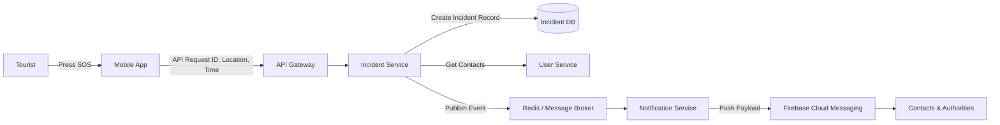
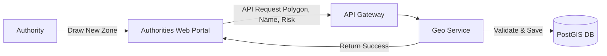
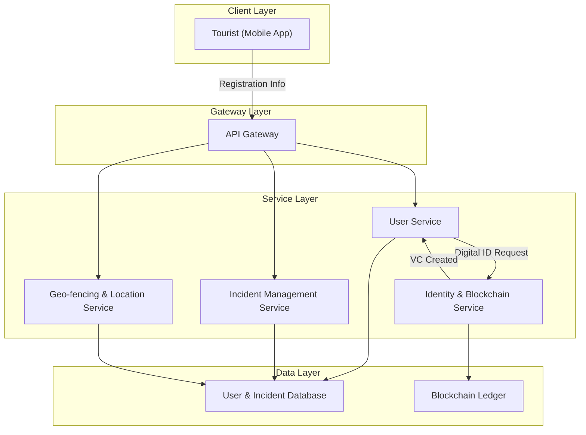

- Home Screen
  - SOS (It should require a long press to activate to prevent accidental triggers.)
  - Status Card? ("Status: You are Safe")
  - Quick Access buttons (Start Live Share, Settings etc)

[] auto refresh every 10secs
[] find logos
[] better ux

# geofencing
- logic must happen on the clients device.
- server maintains a database of geofence coordinates.
- cache this list of zones.
- apps background service checks the phones current gps against the list, if there is a match, it triggers a local notification. 

# ai anomaly detection (must be scalable and privacy focused)
=============================================================================

# client-side (on the phone)
1. fetch geofence data from the server and caches it locally.
2. apps background service gets the location from the native gps api.
3. checks the location against the local geofence
    - if user enters a zone, it triggers a local notification.
4. (anomaly detection)

# emergency event
1. event is triggered (e.g.., SOS Button)
2. client sends { userID, location, alertType? } to the backend server.
3. save the incident details to the db.
4. (we can also send this data to anomaly detection service for further analysis (e.g.., to check if the location is a high-risk zone))
5. backend needs to construct a notification payload
6. sends request to FCM with the payload for user's emergency contacts and authorities.
7. FCM pushes the alert to the relevant devices.

# Flow - 1 (Tourist Onboarding & Digital ID creation)
tourist --> `registration info` --> mobile app

mobile app --> `secure api request` --> api gateway

api gateway --> `routes to` --> user service

user service --> `requests digital id creation` --> identity service

identity service --> `(verify user data and the whole blockchain thing)` --> `creates a temporary **Verifiable Credential** (VC) for the tourist` --> user service

user service --> `saves user profile` --> DB

user service --> `returns success` --> mobile app

mobile app --> `stores token & vc securely` --> encrypted local storage

# Flow - 2 (geofence)
### no location data is sent to the server during this entire process. the server only provides the map of unsafe areas, not the user's location.

mobile app (on launch) --> `request for geofence data` --> api --> geoservice

geoservice --> `returns list of coordinates from DB` --> mobile app

mobile app --> `caches the data` --> encrypted local storage

native gps --> `provides live gps coordinates` --> app's background service

app's background service --> `compares gps against cached zone data` --> (if user enters a zone) --> (mobile app) --> `triggers a local notification`

# Flow - 3 (Manual SOS/ Emergency Alerts)
tourist --> `presses SOS` -- > mobile app

mobile app --> `API request {userID, Location, Timestamp}` --> API gateway

API gateway --> `routes to` --> incident service

incident service --> `creates a new incident record` --> DB

incident service --> `requests user emergency contacts` --> user service

incident service --> `publishes "new incident" event with all data` -> redis (message broker)

notification service (subscribes to redis) --> `receives event`

notification service --> `sends push notif payload` --> FCM --> Emergency contacts & authorities devices

# Flow - 4 (live tracking)
Tourist --> `Taps 'Start Live Share'` --> Mobile App.

Mobile App --> `Establishes secure WebSocket connection` --> Real-time Service.

Mobile App --> `Begins streaming GPS coordinates (JSON payload)` --> Real-time Service.

Real-time Service --> `Authenticates user and assigns them to a private "room".`

(Simultaneously) Emergency Contact --> Opens tracking link/map --> Establishes WebSocket connection and joins the same private room.

Real-time Service --> `Receives new coordinates from Tourist` --> Instantly broadcasts data to all clients in the room.

Emergency Contact's App --> `Receives new coordinates` --> Updates the marker position on the map UI.

# Flow 5 (authorities managing geofence zones)
Authority Personnel --> `Logs in and draws a new zone on the map` --> Authorities Web Portal.

Authorities Web Portal --> `API Request (Polygon Coordinates, Zone Name, Risk Level)` --> API Gateway.

API Gateway --> `Routes request to` --> Geo Service.

Geo Service --> `Validates and saves the new zone data` --> PostgreSQL (PostGIS).

Geo Service --> `Returns success confirmation` --> API Gateway --> Authorities Web Portal.

# Flow 6 (on device anomaly detection)

# Flow 7 (server side AI anomaly detection)

====================================================================

### mermaid.js

